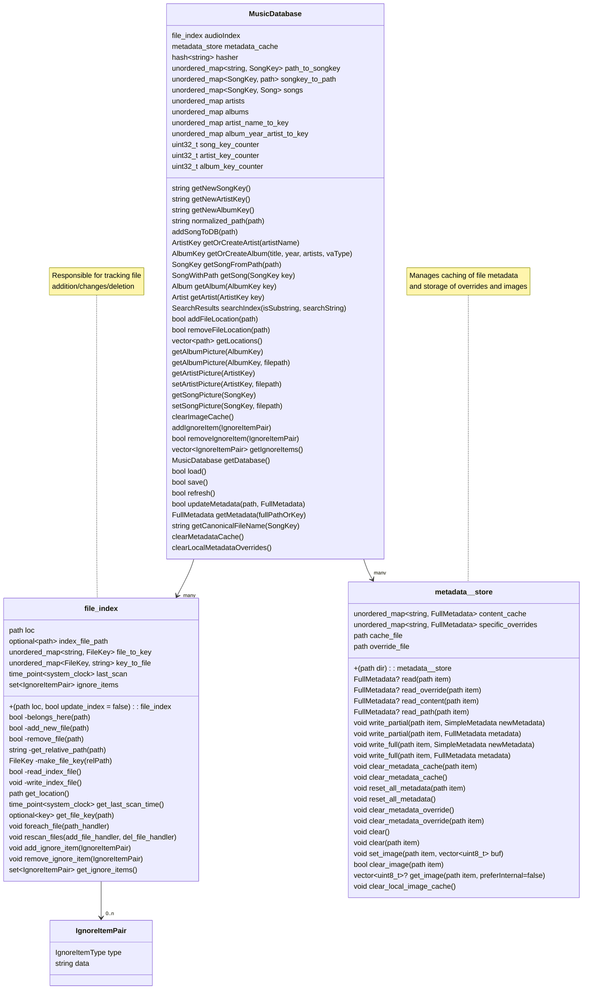

# C++ code for the music player

Here's a class diagram for general reference of what I think I'm building:

```mermaid
classDiagram
note for file_index "Responsible for tracking file
addition/changes/deletion"
class file_index {
  path loc
  optional~path~ index_file_path
  unordered_map~string, FileKey~ file_to_key
  unordered_map~FileKey, string~ key_to_file
  time_point~system_clock~ last_scan
  set~IgnoreItemPair~ ignore_items

  +(path loc, bool update_index = false) : file_index

  bool -belongs_here(path)
  bool -add_new_file(path)
  bool -remove_file(path)
  string -get_relative_path(path)
  FileKey -make_file_key(relPath)
  bool -read_index_file()
  void -write_index_file()

  path get_location()
  time_point~system_clock~ get_last_scan_time()
  optional~key~ get_file_key(path)
  void foreach_file(path_handler)
  void rescan_files(add_file_handler, del_file_handler)
  void add_ignore_item(IgnoreItemPair)
  void remove_ignore_item(IgnoreItemPair)
  set~IgnoreItemPair~ get_ignore_items()
}
class metadata__store {
  unordered_map~string, FullMetadata~ content_cache
  unordered_map~string, FullMetadata~ specific_overrides
  path cache_file
  path override_file

  +(path dir) : metadata__store
  FullMetadata? read(path item)
  FullMetadata? read_override(path item)
  FullMetadata? read_content(path item)
  FullMetadata? read_path(path item)
  void write_partial(path item, SimpleMetadata newMetadata)
  void write_partial(path item, FullMetadata metadata)
  void write_full(path item, SimpleMetadata newMetadata)
  void write_full(path item, FullMetadata metadata)
  void clear_metadata_cache(path item)
  void clear_metadata_cache()
  void reset_all_metadata(path item)
  void reset_all_metadata()
  void clear_metadata_override()
  void clear_metadata_override(path item)
  void clear()
  void clear(path item)
  void set_image(path item, vector~uint8_t~ buf)
  bool clear_image(path item)
  vector~uint8_t~? get_image(path item, preferInternal=false)
  void clear_local_image_cache()
}
class MusicDatabase {
  file_index audioIndex
  metadata_store metadata_cache

  hash~string~ hasher

  unordered_map~string, SongKey~ path_to_songkey
  unordered_map~SongKey, path~ songkey_to_path

  unordered_map~SongKey, Song~ songs
  unordered_map<ArtistKey, Artist> artists
  unordered_map<AlbumKey, Album> albums

  unordered_map<string, ArtistKey> artist_name_to_key
  unordered_map<AlbumTriple, AlbumKey, TupleHash>     album_year_artist_to_key

  uint32_t song_key_counter
  uint32_t artist_key_counter
  uint32_t album_key_counter
  string getNewSongKey()
  string getNewArtistKey()
  string getNewAlbumKey()

  string normalized_path(path)

  addSongToDB(path)
  ArtistKey getOrCreateArtist(artistName)
  AlbumKey getOrCreateAlbum(title, year, artists, vaType)

  SongKey getSongFromPath(path)
  SongWithPath getSong(SongKey key)
  Album getAlbum(AlbumKey key)
  Artist getArtist(ArtistKey key)

  SearchResults searchIndex(isSubstring, searchString)

  bool addFileLocation(path)
  bool removeFileLocation(path)
  vector~path~ getLocations()

  getAlbumPicture(AlbumKey)
  getAlbumPicture(AlbumKey, filepath)
  getArtistPicture(ArtistKey)
  setArtistPicture(ArtistKey,  filepath)
  getSongPicture(SongKey)
  setSongPicture(SongKey, filepath)
  clearImageCache()

  addIgnoreItem(IgnoreItemPair)
  bool removeIgnoreItem(IgnoreItemPair)
  vector~IgnoreItemPair~ getIgnoreItems()

  MusicDatabase getDatabase()
  bool load()
  bool save()

  bool refresh()

  bool updateMetadata(path, FullMetadata)
  FullMetadata getMetadata(fullPathOrKey)
  string getCanonicalFileName(SongKey)
  clearMetadataCache()
  clearLocalMetadataOverrides()
}
class IgnoreItemPair {
  IgnoreItemType type
  string data
}
file_index --> "0..n" IgnoreItemPair
MusicDatabase --> "many" file_index
MusicDatabase --> "many" metadata__store

note for metadata__store "Manages caching of file metadata
and storage of overrides and images"
```
